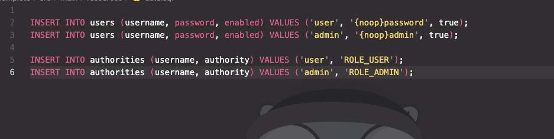

= README

== 1. Mở rộng ứng dụng, với thông tin user được lưu trong CSDL
ảnh minh chứng:

image::https://github.com/trunghh11/gs-securing-web/blob/main/images/user1.png[User 1]

image::https://github.com/trunghh11/gs-securing-web/blob/main/images/user.png[User]

== 2. Hỗ trợ các vai trò USER, ADMIN. Vai trò ADMIN đc vào đường dẫn /admin
ảnh minh chứng:

image::https://github.com/trunghh11/gs-securing-web/blob/main/images/admin_page.png[Admin Page]
